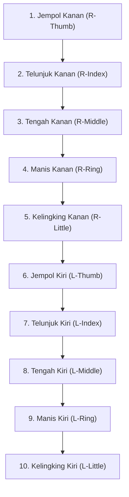

# Panduan Pengguna Visual Lengkap: Tab Allia Finger

Selamat datang di Panduan Pengguna Resmi **Tab Allia Finger** (sebelumnya dikenal sebagai 10-Finger Scanner). Panduan ini dirancang untuk memandu operator dari awal proses login hingga laporan hasil pemindaian sidik jari berhasil diterbitkan menggunakan visual smartphone mockup sebagai referensi langsung.

---

## DAFTAR ISI
1. **Bab 1: Akses Masuk (Login) & Beranda**
2. **Bab 2: Manajemen Sesi Pemindaian**
3. **Bab 3: Alur Pemindaian 10 Jari secara Berurutan**
4. **Bab 4: Fitur Utama & Kontrol Kamera (Akses Transparansi)**
5. **Bab 5: Sistem Evaluasi Kualitas Gambar Instan**
6. **Bab 6: Proses Tinjauan & Verifikasi Admin**
7. **Bab 7: Pembuatan & Riwayat Laporan (Detail Sidik Jari)**
8. **Bab 8: Pertanyaan Umum (FAQ) & Solusi Cepat**

---

## Bab 1: Akses Masuk (Login) & Beranda

| Penjelasan Alur Langkah | Tampilan Layar (Mockup) |
| :--- | :---: |
| **1.1 Login Pengguna:** Saat membuka aplikasi, Anda akan dihadapkan pada layar Akses Masuk: • Masukkan **Nama Pengguna (Username)** dan **Kata Sandi (Password)** Anda. • Centang persetujuan Syarat & Ketentuan Lisensi. • Ketuk tombol **MASUK** melayang (floating button).  **1.2 Dashboard Utama:** Setelah login berhasil, Anda akan masuk ke halaman Beranda: • **Informasi Akun**: Menampilkan nama lembaga serta sisa **Kredit Pemindaian** aktif. • **Navigasi Bawah**: Menu Beranda, Sesi, Tinjauan, Riwayat, dan Profil. |  |

---

## Bab 2: Sesi Pemindaian (Scan Session)

| Penjelasan Alur Langkah | Tampilan Layar (Mockup) |
| :--- | :---: |
| **2.1 Membuat Sesi Baru:** Ketuk tombol **"+ Mulai Pemindaian Baru"** di tab Beranda atau Sesi, masukkan nama subjek dan klik **"Buat Sesi"**.  **2.2 Melanjutkan Sesi yang Tertunda:** Jika proses pemindaian terputus (misalnya baterai habis): 1. Buka tab **Sesi** di navigasi bawah. 2. Cari nama subjek yang statusnya belum selesai (status: `scanning` atau `draft`). 3. Ketuk sesi tersebut, lalu pilih **"Lanjutkan Pemindaian"** untuk melanjutkan dari jari terakhir.  > [!CAUTION] > **Pencegahan Tabrakan Akun (Collision Lock)**: Satu sesi pemindaian dikunci ke satu perangkat aktif. Akses bersamaan dari perangkat berbeda pada sesi yang sama akan otomatis diblokir demi menjaga integritas data sidik jari. |  |

---

## Bab 3: Alur Pemindaian 10 Jari secara Berurutan

Sistem menggunakan wizard terpandu untuk mengambil 10 sidik jari subjek secara otomatis satu per satu dengan urutan berikut:

**Panduan Posisi Sidik Jari:**
* Posisikan **ujung jari** (bantalan atas jari yang berpusat pada guratan melingkar, bukan ruas tengah jari) menghadap ke arah kamera.
* Kotak panduan oval di tengah membantu memposisikan area sidik jari agar pas di tengah lensa.

---

## Bab 4: Fitur Utama & Kontrol Kamera

| Penjelasan Alur Langkah | Tampilan Layar (Mockup) |
| :--- | :---: |
| **4.1 Panel Kontrol Kamera (Sudut Kanan Atas):** • **Senter/Torch (⚡)**: Aktifkan senter secara terus-menerus untuk menerangi guratan sidik jari agar terlihat tajam. • **Siklus Transparansi Overlay (💧)**: Jika layar terasa terlalu gelap, ketuk ikon air untuk mengubah opacity overlay (Low: `0.05` &rarr; Standard: `0.45` &rarr; Medium: `0.25`). Default dimulai dari tingkat **Low (0.05)** agar layar viewfinder terlihat jernih dan terang secara instan.  **4.2 Fokus & Zoom:** • **Zoom Slider**: Atur zoom di kisaran **1.8x s.d 2.0x**. Ini menjaga jarak HP tetap 10-15 cm dari jari subjek sehingga bayangan HP tidak menghalangi cahaya senter. • **Autofocus**: Ketuk layar pada area sidik jari subjek untuk mengunci fokus kamera secara manual. |  |

---

## Bab 5: Sistem Evaluasi Kualitas Gambar Instan

Aplikasi dilengkapi dengan layar **Tinjauan Instan** untuk mengevaluasi gambar sidik jari (hasil crop oval otomatis) secara offline sebelum diunggah ke server:
* **Ikon Ulang (Reload)**: Jika gambar buram atau posisi salah, ketuk ini untuk langsung kembali ke kamera aktif secara instan.
* **Ikon Centang (Gunakan)**: Jika guratan sidik jari terlihat tajam dan jelas, ketuk ini untuk mengunggah ke server.

> [!NOTE]
> Jika server mendeteksi skor kualitas di bawah batas aman, unggahan otomatis ditolak dan kamera diaktifkan kembali agar Anda dapat mengambil ulang tanpa membuang waktu.

---

## Bab 6: Proses Tinjauan & Verifikasi Admin

1. Setelah kesepuluh jari selesai dipindai, sesi akan masuk ke status **"Menunggu Tinjauan" (Waiting for Review)**.
2. Pada akun Admin, sesi tersebut akan muncul di tab **Tinjauan**.
3. Admin akan memeriksa kesepuluh sidik jari yang diunggah. Jika semua gambar memenuhi standar kualitas, Admin menyetujui sesi tersebut. Jika ada jari yang buram, Admin meminta pengambilan ulang (retake) untuk jari spesifik tersebut.

---

## Bab 7: Pembuatan Laporan & Riwayat

| Penjelasan Alur Langkah | Tampilan Layar (Mockup) |
| :--- | :---: |
| **7.1 Menerbitkan Laporan:** Setelah sesi disetujui, tombol **"Buat Laporan"** akan aktif. Ketuk tombol tersebut untuk memotong 1 kredit lembaga Anda dan merangkum analisis ke dalam PDF.  **7.2 Meninjau Detail Sidik Jari:** Setelah laporan dibuat, Anda tetap dapat meninjau sidik jari: 1. Buka tab **Riwayat** dan ketuk laporan subjek. 2. Di bawah tombol download PDF, ketuk **"Lihat Detail Sidik Jari"**. 3. Bottom sheet interaktif akan muncul menampilkan daftar kesepuluh sidik jari klien beserta indikator warnanya (Hijau: Baik, Oranye: Cukup, Merah: Rendah). 4. Ketuk salah satu baris jari untuk membuka dialog pop-up berisi pratinjau diperbesar beserta metrik pola dan ridge count. |  |

---

## Bab 8: Pertanyaan Umum (FAQ) & Solusi Cepat

* **T: Mengapa layar kamera terlalu gelap saat pertama kali dibuka?**
  * *J: Secara default, aplikasi menggunakan overlay gelap (Low: 0.05 opacity) di luar kotak panduan untuk membantu isolasi cahaya. Anda dapat mengubah kegelapan overlay dengan mengetuk ikon air (💧) di kanan atas.*
* **T: Bagaimana cara mencegah hasil foto terdeteksi buram/blur?**
  * *J: Jaga jarak ponsel minimal 10 cm dari jari subjek. Atur zoom kamera bawaan pada tingkat 1.8x s.d 2.0x agar guratan sidik jari terlihat tajam tanpa terhalang bayangan handphone.*
* **T: Saya tidak sengaja menutup aplikasi di tengah jalan.**
  * *J: Semua jari yang sudah diunggah (mendapat tanda centang hijau) telah tersimpan aman di server. Cukup buka tab Sesi, cari nama subjek Anda, dan ketuk "Lanjutkan Pemindaian".*
